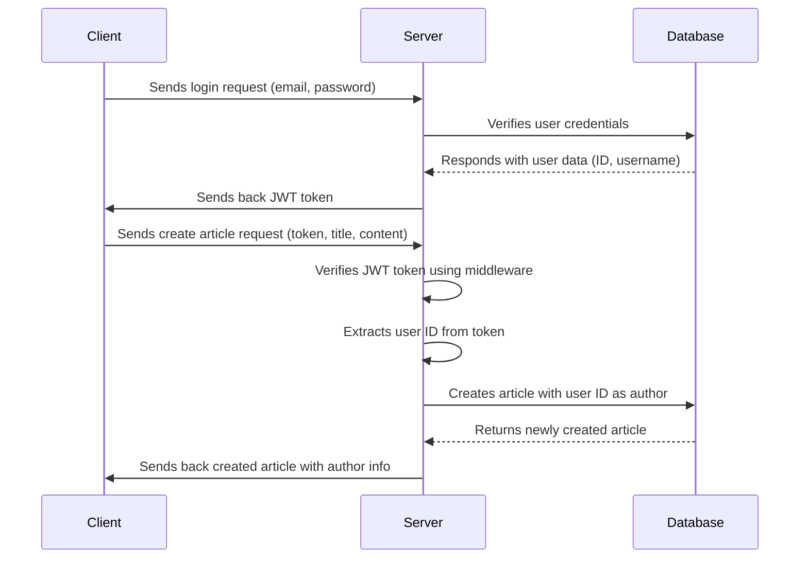

# GreekDevs

## Using dangerouslySetInnerHTML in a React application and sanitize HTML

click [here](https://blog.logrocket.com/using-dangerouslysetinnerhtml-react-application/)

## Code comments

```js
const getAllArticles = async (req, res) => {
  try {
    const articles = await Article.find()

    const truncatedArticles = articles.map((article) => ({
      ...article.toObject(),
      content: truncateContent(article.content),
    }))
    res.status(200).json(truncatedArticles)
  } catch (err) {
    res.status(500).json({ message: err.message })
  }
}
```

`article.toObject()`: This method is typically used with Mongoose documents (assuming you're using MongoDB with Mongoose). It converts the Mongoose document to a plain JavaScript object. This is useful because Mongoose documents have additional properties and methods that you might not want to include when sending data to the client.

## Authentication flow



## useApi hook and context

```javascript
import { useState } from "react"
import axios from "axios"

const useApi = () => {
  const [response, setResponse] = useState(null)
  const [isLoading, setIsLoading] = useState(false)

  const axiosInstance = axios.create({
    baseURL: `${import.meta.env.VITE_API_BASE_URL}`,
  })

  axiosInstance.interceptors.request.use((config) => {
    const token = localStorage.getItem("token")

    if (token) {
      config.headers.Authorization = `Bearer ${token}`
    }
    return config
  })

  const fetchData = async ({ url, method, data = {}, params = {} }) => {
    setIsLoading(true)
    try {
      const res = await axiosInstance({
        url,
        method,
        data,
        params,
      })

      setResponse(res.data) // Keep this for managing user state
      return res.data // Add this to support direct usage of the response
    } catch (err) {
      console.log(err.message)
      throw err
    } finally {
      setIsLoading(false)
    }
  }

  return { response, isLoading, fetchData }
}

export default useApi
```
