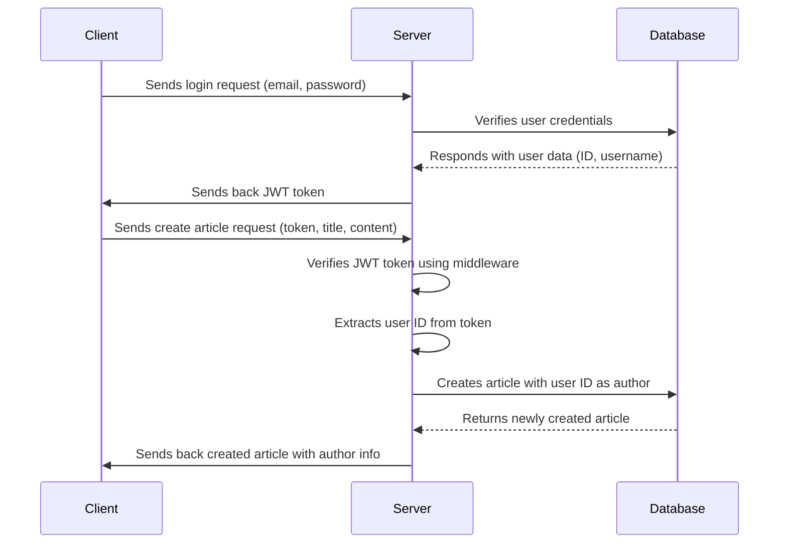

# GreekDevs

## Using dangerouslySetInnerHTML in a React application and sanitize HTML

click [here](https://blog.logrocket.com/using-dangerouslysetinnerhtml-react-application/)

## Code comments

```js
const getAllArticles = async (req, res) => {
  try {
    const articles = await Article.find()

    const truncatedArticles = articles.map((article) => ({
      ...article.toObject(),
      content: truncateContent(article.content),
    }))
    res.status(200).json(truncatedArticles)
  } catch (err) {
    res.status(500).json({ message: err.message })
  }
}
```

`article.toObject()`: This method is typically used with Mongoose documents (assuming you're using MongoDB with Mongoose). It converts the Mongoose document to a plain JavaScript object. This is useful because Mongoose documents have additional properties and methods that you might not want to include when sending data to the client.

## TBD

- Build markdown hook for markdown &harr; HTML
- Register User error handling(email and username exist in the DB)
- Toastify messages at registration

## Authentication flow


