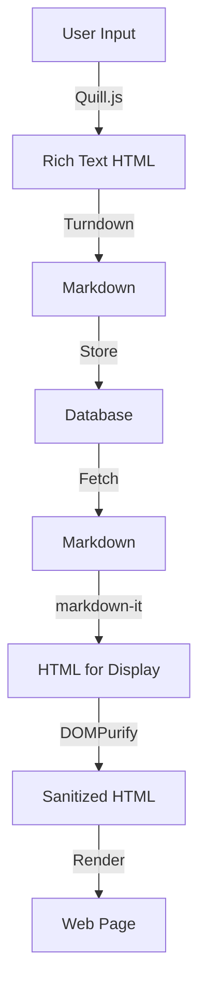

# GreekDevs

## Using dangerouslySetInnerHTML in a React application and sanitize HTML

click [here](https://blog.logrocket.com/using-dangerouslysetinnerhtml-react-application/)

## TBD

- Build markdown hook for markdown &harr; HTML

